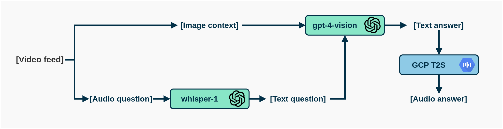

# TiresIAs

TiresIAs is an open-source AI-driven assistant that leverages a vision-language model to process voice queries about the environment and provide audible responses. While its primary objective is to assist individuals with visual impairments or blindness, it can potentially be extended into a broader question-answering assistant with visual capabilities.

> TL;DR: I’ve stiched a few APIs together to ask GPT4 questions about whatever happens to be in front of you, potentially useful for visually impaired people.

Devlog / blog post / whatever you wanna call it about the project [here (TBA)]().

### Demo video

---

# How it works
Currently this repo only holds a quite simple proof-of-concept, the inner working is outlined in the diagram below. Basically, the `run` function takes an audio file with a question and an image, (1) converts the audio to text using Whisper, (2) asks GPT-4V the corresponding question while passing the context image, and then it (3) converts the answer to the question to audio using GCP Text-to-Speech API.

---

# Instructions to install / run the project
Soon™️

---

# Backlog
Main things I want to add in the near future listed in no particular order.

- [ ] Add demo video.
- [ ] Add blog post.
- [ ] Refactor code to use classes + error handling.
- [ ] Add instructions to the readme + requirements and so on.
- [ ] Add speech thresholding / question extraction before S2T.
- [ ] Local whisper (whisper.cpp).
- [ ] Local Vision-Language model (BakLLaVA?).
- [ ] Android app (API-based).
- [ ] Android app (on-device models).
- [ ] Jetson edge execution + glasses.

---
